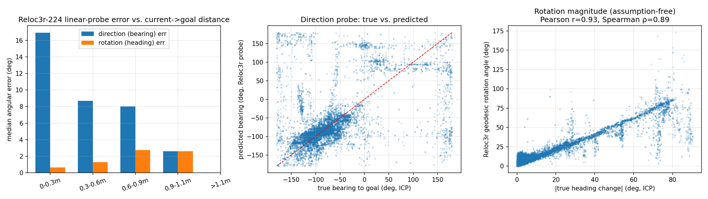

# Reloc3r 도입 검증 (2026-07-21) — zero-shot relative pose 신호가 이 도메인에서 쓸만한가

> 배경: `docs/reloc3r.png` (현재 branch `reloc3r`에 스케치된 아키텍처) — DINO를 Reloc3r로 교체해서
> (current_img, goal_img) → relative pose를 lidar/goal-lidar/encoder와 함께 sensor fusion
> transformer에 태우는 안. 학습 파이프라인에 붙이기 전에, **fine-tuning 없이 off-the-shelf
> Reloc3r-224가 이 로봇의 도킹 이미지 도메인에서 애초에 의미 있는 신호를 주는지**를 먼저 확인한다.
> 결론부터: **rotation(heading) 신호는 강하고 신뢰할 만하다 (median 0.9°, r=0.93). direction(bearing)
> 신호는 baseline보다는 낫지만 근거리(0-0.3m)에서 오히려 나빠진다** — 하필 도킹 정밀도가 가장
> 중요한 구간. 결론 및 권장사항은 §5 참고.

## 0. 왜 이 실험인가

DINO→Reloc3r 교체를 검토하면서 두 가지 근본적 리스크가 있었다:
1. Reloc3r의 translation 출력은 **scale-ambiguous(단위벡터, metric distance 아님)** — 논문
   설계상 원리적 한계. → lidar가 metric scale을 채워줘야 하는데, 지금 diagram이 이미 그렇게
   그려져 있어서 아키텍처 정당성 자체는 괜찮음.
2. Reloc3r은 CO3D/ScanNet++/ArkitScenes/MegaDepth/DL3DV/RealEstate10k 같은 **중~광각 baseline
   scene-level 데이터**로 학습됐고, 이 로봇의 도킹 접근 장면(타일 바닥 위 소형 도킹 fixture를
   근거리·하향 각도로 보는 화면)과는 도메인이 다르다 — 논문 자체에 small-motion/근접 pair 분석은
   없음(테스트 안 해본 리스크이지 실패로 보고된 건 아니었음).

이 두 리스크 중 (2)는 학습 없이 반나절짜리 실험으로 직접 검증 가능하다: 이미 존재하는
LiDAR-ICP `dock_pose` ground truth와, 이미 존재하는 (current_frame, goal_frame) 쌍을 이용해서
frozen Reloc3r의 출력을 바로 채점하면 된다.

## 1. 방법론

### 1.1 모델
- **Reloc3r-224** (`siyan824/reloc3r-224`, HuggingFace 자동 다운로드), ViT-L encoder(24 layer) +
  ViT-B decoder(12 layer) + regression head, **426.5M params** (논문 공식 수치 0.42B와 일치).
  완전 zero-shot — fine-tuning 없음, gradient 없음.
- RoPE CUDA 커널 컴파일은 실패했으나(`ninja` 빌드 이슈) 레포에 내장된 pure-PyTorch fallback으로
  대체 — 이 실험 규모(H100, pair당 14~36ms)에는 문제 없음. 프로덕션에 넣을 거면 재시도 권장.
- 카메라는 **room2 / `image_bottom`** 만 사용 (현재 `smr.yaml`의 `use_room1: false` 기본값과 동일
  조건).

### 1.2 데이터 및 ground truth 구성
- **Fit(linear probe 학습)**: `dataset/after_0328_train.h5`, 145 episode 중 episode당
  reliable frame을 최대 80개 샘플링 → **11,600 pairs**.
- **Eval(평가)**: `dataset/after_0328_test.h5`, held-out 10 episode의 **reliable frame 거의
  전부** → **14,824 pairs** (train과 완전히 분리된 episode — 이 프로젝트의 기존 train/test
  split을 그대로 재사용).
- **Ground truth**: 초기에 "goal frame ≈ 도킹 완료 상태이므로 `dock_pose_goal ≈ (0,0,0)`"이라고
  가정하려 했으나, 실제 값을 찍어보니 **모든 episode에서 goal frame의 `dock_pose`가 일관되게
  `(≈0, ≈-0.53, ≈0)`으로 0이 아니었다** (아마 LiDAR 센서 원점과 실제 도킹 접촉점 사이의 고정
  오프셋; §2 참고 — 기존에 파악된 "~90°/-87.9° 센서→로봇 캘리브레이션이 기본값에 안 걸려있다"는
  이슈와 같은 계열의 문제로 보임). 그래서 단순 차분 대신, `utils/docking_dataset.py`의
  `_relative_to_goal` (= `endgame/se2.py`의 `compose(inverse(goal), current)`)을 그대로 포팅해서
  **current pose와 goal pose를 SE(2) 합성**했다 — 이러면 두 프레임에 공통으로 낀 고정 오프셋이
  자동으로 상쇄된다. `gt_dist = hypot(dx,dy)`도 이 합성 결과에서 계산.
- 카메라 intrinsic/extrinsic 캘리브레이션은 레포 어디에도 없음(별도 확인 완료) → Reloc3r의
  카메라 좌표계 출력을 ICP의 dock_pose 좌표계와 직접 비교할 수 없다. 그래서 **linear probe**
  방식으로 우회: train set에서 "Reloc3r 출력 → ICP 정답"으로 가는 최소자승 선형 변환을 학습하고,
  held-out test set에서 그 probe의 오차만 평가한다 (frozen feature를 평가할 때 쓰는 표준적인
  linear-probing 방법론과 동일한 발상 — "이 출력에서 원하는 기하 정보가 (선형으로) 읽히는가"만
  본다). 즉 이 실험은 **정식 camera-robot 캘리브레이션이 아니라 신호 존재 여부에 대한 보수적
  하한선**이다 — 실제 fusion transformer는 비선형이고 lidar/encoder까지 같이 보므로 여기 나온
  숫자보다 더 잘할 가능성이 높다.
  - **Direction probe**: Reloc3r의 unit translation vector `t∈R³` → `(cosθ,sinθ)` 2×3 최소자승.
  - **Rotation probe**: Reloc3r의 rotation matrix `R` (flatten 9) → `(cosΔθ,sinΔθ)` 2×9 최소자승.
  - **보정 없이 보는 지표도 하나 추가**: `arccos((trace(R)-1)/2)` (geodesic rotation angle, 축에
    대한 가정이 전혀 없음) vs ICP의 `|Δheading|` 사이의 상관계수 — 이건 fitting이 전혀 없는
    가장 엄격한 신호 존재 검증.
- **Baseline 비교**: (a) train set의 평균 방향/각도로만 찍는 constant predictor, (b) 완전
  uniform random 예측 — Reloc3r probe가 이 둘보다 못하면 신호가 없다는 뜻.

### 1.3 재현
스크립트는 현재 scratchpad(`/tmp/.../scratchpad/reloc3r_eval/{extract_and_infer.py,analyze.py}`)에
있음 — 저장소에 커밋된 코드는 아님. 재실행하거나 저장소에 정식으로 편입하고 싶으면 말해줘.

## 2. 결과

### 2.1 Rotation (heading) — 강한 신호

| | median | mean | p90 | std | n |
|---|---|---|---|---|---|
| **Reloc3r rotation probe** | **0.90°** | 5.71° | 5.94° | 18.81° | 14,824 |
| constant baseline (train 평균) | 4.54° | 16.66° | 58.32° | 23.20° | 14,824 |

**Geodesic rotation magnitude 상관관계 (fitting 없음, 가장 엄격한 검증)**:
Pearson r = **0.927**, Spearman ρ = **0.893** (n=14,824) — Reloc3r의 raw rotation 출력 크기가
ICP `|Δheading|`와 거의 선형에 가깝게 붙어 있다. Zero-shot 치고 매우 강한 결과.

### 2.2 Direction (bearing to goal) — baseline보다는 낫지만 근거리에서 약함

| | median | mean | p90 | std | n |
|---|---|---|---|---|---|
| **Reloc3r direction probe** | **11.49°** | 25.77° | 75.04° | 35.68° | 14,824 |
| constant baseline (train 평균) | 16.40° | 29.96° | 85.68° | 34.87° | 14,824 |
| uniform random | 89.29° | 89.69° | 161.91° | 51.94° | 14,824 |

random baseline 대비로는 확실히 신호가 있지만, mean-median 격차(25.8° vs 11.5°)가 크다 —
꼬리가 두꺼운(가끔 크게 틀리는) 분포.

### 2.3 거리별 stratification (test set) — 핵심 발견

| 거리 구간 | n | direction median / mean | rotation median / mean |
|---|---|---|---|
| 0–0.3m | 7,883 | **16.91° / 33.15°** | **0.63° / 1.03°** |
| 0.3–0.6m | 4,156 | 8.70° / 13.94° | 1.28° / 4.22° |
| 0.6–0.9m | 2,241 | 8.02° / 26.72°(꼬리 두꺼움) | 2.74° / 23.57°(꼬리 두꺼움) |
| 0.9–1.1m | 544 | **2.62° / 5.20°** | 2.60° / 11.22° |
| >1.1m | 0 | (reliable ICP 라벨 자체가 없음, `aux_dist_max=1.1m`와 일치) |

(테스트셋 거리 분포: median 0.28m, p90 0.78m, max 1.03m — 대부분 근거리 표본)

**direction 오차는 거리가 가까울수록 median 기준 단조 증가(2.6°→8.0°→8.7°→16.9°)** — 즉
도킹 마지막 구간(정밀도가 가장 중요한 순간)에서 방향 신호가 가장 나쁘다. 반대로 **rotation
오차는 근거리(0-0.3m)에서 오히려 가장 좋다.** 두 신호가 반대 방향으로 움직인다.

기하학적으로 말이 된다: baseline(현재-goal 카메라 사이 거리)이 짧아질수록 translation
*방향*은 원래 ill-conditioned해진다(벡터 크기가 0에 가까워지므로 방향 추정 자체가 어떤
방법으로도 민감해짐 — Reloc3r만의 문제가 아니라 monocular 상대 pose의 일반적 성질). 반면
rotation은 baseline이 0에 가까워도(순수 회전이면 baseline=0이어도) 잘 추정되는 게 이론적으로도
자연스럽다.

### 2.4 정성적 확인 (이미지 직접 확인)

`image_bottom`(room2)은 도킹 스테이션(작은 녹색 박스, 발광 마커)을 **근거리·하향 경사각**으로
내려다보는 화면이었고, 배경은 **반복적인 타일 패턴** 바닥이었다. Reloc3r 학습 데이터 중
CO3Dv2(object-centric, 카메라가 물체를 돌며 촬영)가 그나마 구도상 가장 유사하고, ScanNet++/
MegaDepth/RealEstate10k류(방 스케일, 랜드마크, 부동산 워크스루)는 이 장면과 결이 많이 다르다.
반복적 타일 텍사처는 correspondence 매칭에 일반적으로 불리한 조건이라는 점도 참고.
(`docs/img/reloc3r_relpose_eval.png` 플롯과 별개로, 실제 스팟체크 이미지들은 코드와 함께
scratchpad에 있음.)

## 3. 이 결과가 기존 아키텍처 논의에 의미하는 것

- **Rotation은 additive 신호로 넣을 근거가 충분하다.** Zero-shot 성능이 이미 강하고
  (median<1°, r=0.93), 하필 정밀도가 중요한 근거리에서 더 좋아진다. DiT 쪽 conditioning에
  더할 후보 1순위.
- **Direction(거리 방향)은 lidar에 맡기는 게 맞다는 근거가 강해졌다.** 원래 "Reloc3r은
  scale을 모르니 lidar가 metric distance를 채워야 한다"는 설계였는데, 이번 실험으로 **방향
  성분조차 근거리에서 신뢰도가 떨어진다는 게 확인됐다** — lidar가 metric scale뿐 아니라
  근거리 방향/위치 전반에서 더 믿을 만한 소스가 돼야 한다는 뜻. Diagram에 lidar/goal-lidar가
  이미 들어가 있는 건 결과적으로 더 정당화된다.
- **`docs/ablation_study_2026-07.md` §2.9-2.10의 선행 실패 사례**("LiDAR-ICP 두 추정치를
  합성한 explicit relative pose를 conditioning에 넣었더니 noise floor가 5.7mm→9.7mm로
  악화, 기각")와 연결지어 보면: 그 실패는 "노이즈 있는 추정치 두 개를 합성"해서 노이즈가
  누적된 것이었고, 이번 Reloc3r의 direction 신호도 근거리에서 노이즈가 커진다는 걸 확인했으니
  — **direction을 explicit conditioning으로 그대로 넣으면 같은 실패를 반복할 위험이 실제로
  있다.** 반면 rotation은 그 선행 실패와는 다른 성질(근거리에서 오히려 강함)이라 더 안전한
  후보로 보인다.
- **Fine-tuning 여지**: 지금 성능은 순수 zero-shot이다. 근거리 direction 저하가 "학습 안 된
  도메인이라서"인지 "근본적으로 ill-conditioned해서"인지는 이 실험만으론 완전히 못 갈랐다
  (기하학적으로 후자가 최소한 일부 원인인 건 맞지만, fine-tuning으로 어느 정도 개선될 여지는
  있음 — 이미 존재하는 ICP 기반 relative pose를 약지도 라벨로 써서 decoder/head만 fine-tune
  해보는 실험이 다음 후보).

## 4. 이 실험의 한계 (과대해석 주의)

- **Linear probe는 보수적 하한선이다.** 실제 fusion transformer는 비선형이고 lidar/encoder
  정보까지 같이 보므로, 여기서 측정한 것보다 더 많은 신호를 뽑아낼 수 있다. 반대로 이 probe가
  "신호 있음"으로 나온 rotation 결과는 오히려 더 안심해도 된다 (약한 방법으로도 나온 신호이므로).
- **Ground truth 자체도 ICP 두 추정치의 합성이라 노이즈가 있다** (§1.2) — 특히 아주 가까운
  거리에서 ICP 자체 정밀도가 어떻게 변하는지는 이번에 따로 측정하지 않았다. 즉 근거리 direction
  오차 증가가 "Reloc3r의 한계"인지 "ground truth 노이즈 증가"인지 완전히 분리되지 않았다 —
  다만 두 회전 계열 지표(rotation probe, geodesic correlation)는 정반대 경향(근거리에서 개선)을
  보이므로, ground truth 노이즈만으로는 이 비대칭을 설명하기 어렵다.
- Reloc3r-224만 테스트했다(512는 미검증 — 해상도가 높으면 근거리 direction이 나아질 수도
  있음). 카메라도 room2 하나만 봤다(room1/`image_top`은 미검증, `use_room1:false` 기본값과
  일치하는 선택이긴 함).
- Train-fit에 쓴 11,600 pairs는 episode당 최대 80개로 상한을 둔 샘플이라 전수는 아니다
  (test는 거의 전수 사용).

## 5. 권장 다음 단계

1. **Rotation을 additive feature로 우선 프로토타입.** DINO를 걷어내지 말고, 지금 fusion
   transformer에 Reloc3r rotation 관련 토큰(예: 6D rotation repr + geodesic angle)을 추가해서
   기존 최고 baseline(noise floor 5.7mm, `docs/ablation_study_2026-07.md`) 대비 A/B.
2. Direction은 이번 결과 기준으로는 **conditioning에 explicit하게 넣기보다 lidar에 맡기는
   현 설계를 유지**하는 쪽을 권장. 굳이 넣는다면 근거리 구간에서 신뢰도가 낮다는 걸 모델이
   알 수 있게(예: 거리 추정치를 함께 넣거나) 하는 게 안전.
3. Rotation 신호가 additive로 유효하다고 확인되면, 그다음 단계로 **ICP 기반 relative pose를
   약지도 라벨 삼아 decoder/head fine-tuning**을 시도 — 특히 근거리 direction 개선 여지가
   있는지 확인.
4. 실제 배포 하드웨어에서 pair당 latency 재측정 (이번 실험은 H100 기준 14~36ms/pair — 로봇
   온보드 GPU에서는 다를 수 있음). 현재 vision encoding은 `vision_stride=6`이라 새 프레임당
   ~200ms 예산이 있음 (§ 이전 아키텍처 리뷰 참고).
